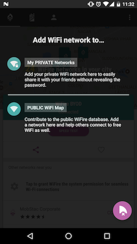
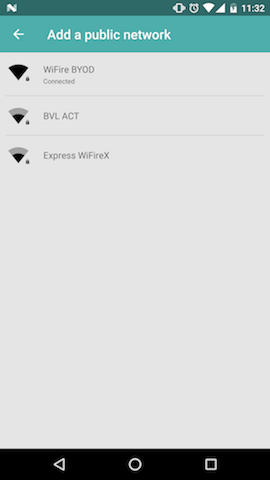
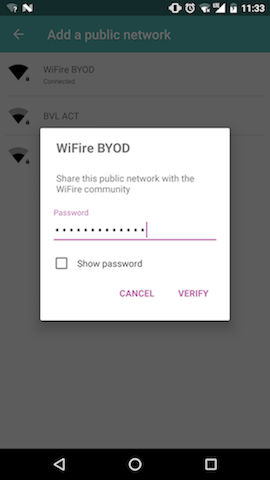
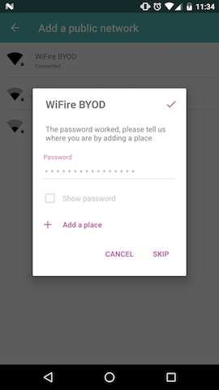
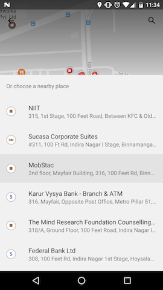
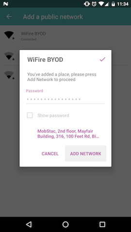

## Follow these steps to add your own network to WiFire for testing connectivity and notifications 

1. Download WiFire App 
	- https://itunes.apple.com/in/app/wifire-free-wifi-map-find-nearby-free-wifi/id1086873283
	- https://play.google.com/store/apps/details?id=com.mobstac.wildfire

2. Perform following steps 
	- Click on 'Add Network' 
	- Select 'PUBLIC WiFi Map'
	- Select your WiFi network from the list
	- Verify password 
	- Add a place. This allows you to detect the place that the user is at 

3. Wait for an hour (It takes roughly one hour for new hotspots to appear in the SDK's list)

  
  
 

#### After performing these steps, you should be able to see your network in the WiFire list. Now you can begin testing connectivity, notifications, etc.