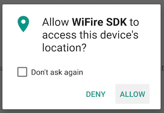

## Pre-requisites for WiFi scanning to work

### 1. Location
* Location must be enbled for WiFire to scan and identify WiFi hotspots. 

* Starting from Android 6.0 the user must grant runtime permission to the App 
   

### 2. WiFi State

WiFire can scan for networks in either of two cases

* WiFi is turned on.
* WiFi Background scanning is turned on

### 3. Internet access

 WiFire needs Internet access to sync and download information about public WiFi hotspots around the user's location.

 Once synced it will be cached offline and internet connectivity will not be required while the user is in that area.

 If the user moves out of the synced area internet connection will be used again to download hotspots.
